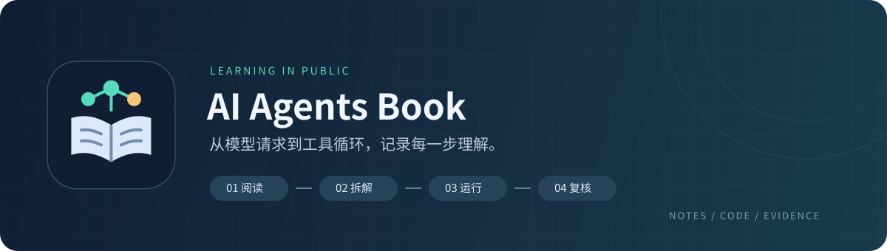

<p align="center">
  
</p>

<h1 align="center">📚 AI Agents Book学习记录</h1>

<p align="center">从一次模型请求开始，逐步理解Agent的工具调用、消息流与执行循环。</p>

[](https://github.com/lizhuofan-curry/ai-agents-book-learning/actions/workflows/ci.yml)
[](pyproject.toml)
[](uv.lock)
[](LICENSE)

<p align="center">
  <a href="第一章/README.md">🧭 章节导航</a> ·
  <a href="第一章/1.2网络搜索Agent/README.md">🔎 搜索Agent</a> ·
  <a href="第一章/1.2网络搜索Agent/实验记录.md">📝 运行记录</a> ·
  <a href="https://github.com/bojieli/ai-agent-book">📖 原教材</a>
</p>

## 🌱 为什么整理这个仓库

学习[李博杰的《深入理解AI Agent》](https://github.com/bojieli/ai-agent-book)时，我觉得原仓库的代码和目录比较分散，章节、实验与代码之间的对应关系不太直观，查找和复习时不太方便。

因此，我一边阅读和理解原代码，一边按章节和实验整理项目结构，补充适合自己学习节奏的代码、注释和运行记录。这里记录的是我实际学习和动手的过程。

| 在这里看什么 | 内容 |
|---|---|
| 🧩 分步代码 | 从离线观察到真实搜索，把完整Agent拆成01～10个学习步骤 |
| 💬 阅读指南 | 解释输入、处理、输出，以及变量和消息如何变化 |
| 🧪 运行证据 | 保存JSON、调用轨迹、正常回答和达到轮数上限的记录 |
| 🔍 来源核查 | 对照来源检查答案，记录日期错误、引用问题与未确认的描述 |

## 🗂️ 项目结构

```text
AI_Agents_Book/
├── assets/                 # 自制书本与Agent节点图标、README横幅
├── 第一章/
│   ├── 1.1上下文消融/
│   ├── 1.2网络搜索Agent/
│   │   ├── 我的代码/       # 按学习步骤编号的代码
│   │   ├── 运行结果/       # 离线演示与实际运行记录
│   │   └── README.md       # 当前进度、代码说明与官方链接
│   ├── 1.3搜索与代码执行/
│   ├── 1.4图像生成工作流/
│   └── 拓展-从经验中学习/
├── ai-agent-book/           # 已有的教材总览、排期与实验清单
├── .env.example            # API配置模板
├── pyproject.toml           # uv依赖配置
└── uv.lock                  # 依赖版本锁定
```

## ✅ 第一章学习进度

第一章已按本人的学习范围完成（2026-10-06）。本章重点学习了Agent循环、工具调用、上下文消融和图像生成工作流；实验1.3由本人决定跳过，目录仅保留为官方内容索引。

- **实验1.1已完成**：运行DeepSeek兼容的四组上下文消融。完整上下文组正确完成任务，其余组展示了历史、工具定义和工具结果的作用；`no_reasoning`受DeepSeek工具协议限制，未作为等价实验运行。
- **实验1.2已完成**：真实运行模型对话、搜索工具、结果回传、完整Agent循环、交互提问、命令行参数与引导式体验。详见[实验记录](第一章/1.2网络搜索Agent/实验记录.md)。
- **实验1.3已跳过**：根据个人学习安排不再实施搜索与代码执行实验，保留[官方实验索引](第一章/1.3搜索与代码执行/README.md)。
- **实验1.4本地核心版已完成**：使用同一个万相模型比较原始提示词与DeepSeek改写提示词，2个需求、2条路线共4张图全部成功，并完成逐项评分。官方5需求×3路线未全量复现。详见[实验报告](第一章/1.4图像生成工作流/运行结果/20261006_105801/实验报告.md)。

以下表格保留实验1.2的分步运行摘要：

| 学习步骤 | 已观察到的结果 |
|---|---|
| 01·离线观察 | 已运行预写轨迹，理解行动、观察与回答的关系 |
| 02～06·真实搜索循环 | Context Caching问题完成4轮模型请求、9次成功搜索；调用ID与结果回传已核对 |
| 07·统一入口 | Python3.12问题完成2轮模型请求、1次搜索；主要答案已核对官方资料 |
| 08·交互提问 | 两个独立问题均完成；天气答案的更新时间与部分描述尚未确认 |
| 09·命令行参数 | 已观察轮数上限、失败保存、正常回答、quiet与指定输出路径 |
| 10·引导式体验 | 已真实运行菜单退出及现成问题搜索：2轮模型请求、2次搜索；回答中的当前日期有误 |

工具返回成功、循环正常结束和答案事实正确，需要分别检查。离线演示使用预写轨迹；真实问答的原始回答保存在JSON中，核查说明写在实验记录中，不覆盖模型原文。

## 🙏 来源与改动

学习代码参考[原仓库的实验1.2实现](https://github.com/bojieli/ai-agent-book/tree/main/chapter1/web-search-agent)，按当前理解拆成较小步骤，补充中文注释，并调整为本项目的配置和输出路径。来源与许可见[THIRD_PARTY_NOTICES.md](THIRD_PARTY_NOTICES.md)。

## 🐍 本地环境

所有章节共用项目根目录的Python3.11环境：

```text
E:\AI_Agents_Book\.venv\Scripts\python.exe
```

`第一章`保存分类后的学习材料、自己的代码和运行结果；`ai-agent-book`保存已有的总览、排期和实验清单。官方仓库按学习进度在线查阅。

## 🛠️ PyCharm配置

在项目设置的Python解释器页面添加本地解释器，选择现有环境，浏览并选择上述`python.exe`，应用到当前`AI_Agents_Book`项目。

## 🚀 环境管理与运行

依赖由根目录的`pyproject.toml`和`uv.lock`管理。已安装的基础包和第一章依赖在同一个环境中，后续章节按需添加。

需要重新同步环境时，在终端运行：

```powershell
Set-Location 'E:\AI_Agents_Book'
& 'E:\Hermes\bin\uv.exe' sync --locked --python 3.11 --cache-dir 'E:\AI_Agents_Book\.uv-cache'
```

后续添加依赖，在项目根目录使用`uv add 包名`。日常在PyCharm中运行自己的学习代码，使用配置好的项目解释器。

安装uv后，也可以在项目根目录使用通用命令：

```powershell
uv sync --locked --python 3.11

# 离线演示：不需要API Key，不调用真实搜索
uv run --locked python "第一章/1.2网络搜索Agent/我的代码/01_离线观察Agent循环.py"
```

真实搜索先将`.env.example`复制为`.env`，填写`MOONSHOT_API_KEY`，再运行引导式入口：

```powershell
# 仅在.env不存在时复制模板，保留已有配置
if (-not (Test-Path .env)) { Copy-Item .env.example .env }
# 编辑.env并填写自己的API Key后运行
uv run --locked python "第一章/1.2网络搜索Agent/我的代码/10_引导式快速体验.py"
```

配置见[实验1.2README](第一章/1.2网络搜索Agent/README.md)，菜单用法见[10阅读指南](第一章/1.2网络搜索Agent/10_阅读指南.md)。每题输出保存在该实验的`运行结果`目录。

## 🧭 学习入口

| 实验 | 主要学习内容 | 入口 |
|---|---|---|
| 🧠 1.1上下文消融 | 移除部分上下文，观察调用与回答的变化 | [说明](第一章/1.1上下文消融/README.md) · [分步指南](第一章/1.1上下文消融/实验1-1学习指南.md) |
| 🔎 1.2网络搜索Agent | 工具定义、真实搜索、消息回传、多轮循环 | [说明](第一章/1.2网络搜索Agent/README.md) · [实验记录](第一章/1.2网络搜索Agent/实验记录.md) |
| ⏭️ 1.3搜索与代码执行 | 本次学习选择跳过，保留官方内容索引 | [说明](第一章/1.3搜索与代码执行/README.md) |
| 🎨 1.4图像生成工作流 | 图像生成中的多步工作流 | [说明](第一章/1.4图像生成工作流/README.md) |
| 🌿 拓展·从经验中学习 | 官方learning-from-experience项目 | [说明](第一章/拓展-从经验中学习/README.md) |

- [第一章分类目录](第一章/README.md)
- [官方第一章实验目录](https://github.com/bojieli/ai-agent-book/blob/main/chapter1/README.md)
- [官方第一章正文](https://github.com/bojieli/ai-agent-book/blob/main/book/chapter1.md)

## ☁️ GitHub同步

仓库：[lizhuofan-curry/ai-agents-book-learning](https://github.com/lizhuofan-curry/ai-agents-book-learning)。

在项目根目录查看改动，用Git提交并同步学习记录：

```powershell
git status
git add .
git commit -m "记录本次学习进度"
git push
```

`.gitignore`忽略本地.env、虚拟环境、缓存和PyCharm配置；.env.example保留为配置模板。

## 🤖 自动检查与版本发布

CI在推送main、提交Pull Request或手动触发时运行，使用Python3.11在Windows和Linux上同步锁定依赖、检查Python语法与已跟踪文件，并实际运行离线演示，核对JSON输出和轨迹。CI不调用真实Kimi或搜索API。

本地执行同一项检查：

```powershell
uv run --locked python .github/scripts/check_repo.py
```

CD在推送`v*`版本标签时触发，先运行相同检查，通过后发布GitHub Release，附上源码ZIP与SHA256校验文件。准备发布某个学习版本时，在已提交且同步的main上创建并推送标签，例如：

```powershell
git tag v0.1.0
git push origin v0.1.0
```

## 📜 许可证

本项目使用[Apache License 2.0](LICENSE)，与原仓库的根目录许可证一致。原代码的来源、版权和本地改动说明见[NOTICE](NOTICE)与[THIRD_PARTY_NOTICES.md](THIRD_PARTY_NOTICES.md)。

## 📖 学习与指导方式

学习顺序遵循官方第一章README的入门路线，讲解沿用HelloAgents的逐步学习节奏。

- 每次先解释当前代码的作用，以及输入、处理和输出，再指导运行或修改。
- 使用一个固定例子，展示变量的实际值和完整执行过程，说明用户、模型、Python和工具各自负责什么。
- 根据当前理解补充必要的Python基础，区分标准库、自己定义的函数、模型SDK和远程服务。
- 运行后解释每类输出，用一个小修改练习拓展理解，再用一个小问题确认掌握情况。
- 每次只推进一个学习目标，理解当前步骤后再进入下一步。
- 每个实验按自己的官方README逐项完成。离线演示之后继续配置真实服务、运行和分析结果，不把离线演示视为整个实验完成，也不提前跳到其他实验。
